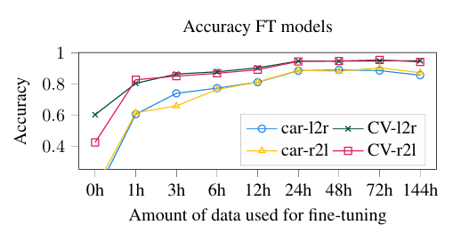
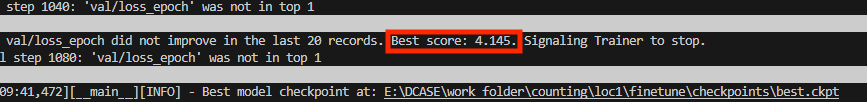
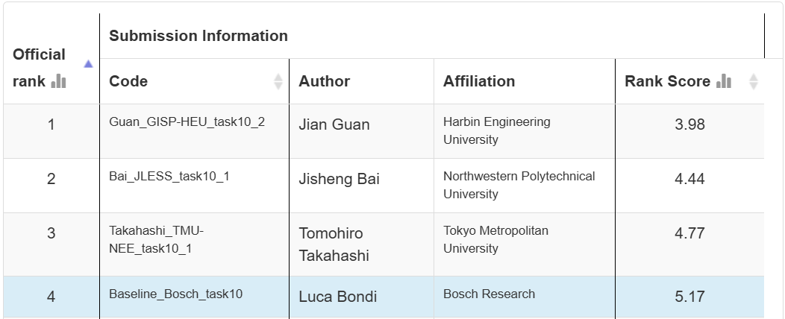
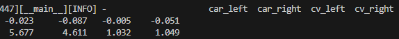

# 复现过程

---

根据论文 EXPERIMENTAL EVALUATION 部分得出的结论，使用合成数据预训练后，使用二十四小时的真实数据进行训练，效果饱和。

---

使用官方提供的 simulation 中的 loc1 作为预训练的合成数据。并使用官方的真实的 loc1 (20h)数据作为微调数据。

相关训练参数使用默认不作修改，根据显存大小相应调低 batch size。

#### 验证集结果
其中验证集的结果如下所示

同官网中给出的结果进行对比。

结果相近

#### 测试集结果

由于官网上并无提供测试集标签，因此使用官方提供的 loc6 的训练集作为 loc1 的测试集进行测试。结果如下所示

结果较差，推测是由于环境差异造成。
